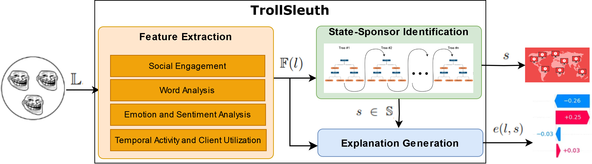

## TrollSleuth: Behavioral and Linguistic Fingerprinting of State-Sponsored Trolls

 This repository provides the implementation of our proposed approach for Troll Attribution, inspired by cyber threat attribution principles, to analyze and identify the state-sponsored sources behind disinformation campaigns on social media. Our work proposes a comprehensive framework, TrollSleuth, that leverages linguistic and behavioral fingerprints to uncover deeper insights into the motivations and origins of troll accounts. 

## Overview

## Dataset 

 Social media providers have been working to identify and suspend troll accounts, releasing information about them afterward. This has enabled researchers to gain insights into the operations of troll accounts and the narratives they promote, particularly regarding state-sponsored troll accounts active on Twitter: https://transparency.twitter.com/en/reports/information-operations.html (accessed and downloaded on: 5/14/2024) 

## Code Structure

 This section outlines the main files in the repository and their specific roles in the framework. 

#### [feature_extraction.py](feature_extraction.py)

 This file is responsible for extracting features from the dataset by processing raw social media data. It computes linguistic and behavioral characteristics essential for Troll Attribution, leveraging four distinct analytical modules: Social Engagement, Word Analysis, Emotion and Sentiment Analysis, and Temporal Activity and Client Utilization Analysis.

#### [identification_model.py](./identification_model.py)

 This file trains a classifier to perform troll attribution using the extracted features and evaluates its performance. Additionally, it assesses the resilience of the model by applying sensitivity analysis through noise injection, helping to understand how the model responds to variations in the data and ensuring its robustness.

#### [explanation_generation.py](explanation_generation.py)

 This file generates feature importance-based explanations for the predictions made by the classifier. It helps interpret the model's outputs by highlighting which features contributed the most to the classification, using SHAP (Shapley Additive Explanations) values to provide insights into the decision-making process of the model.

#### [plots.py](plots.py)

 This file generates visualizations to assist with data analysis, model evaluation, and interpretation. It creates plots that help visualize key insights, including feature distributions, classification performance, and feature importance, aiding in a better understanding of the model and results.

